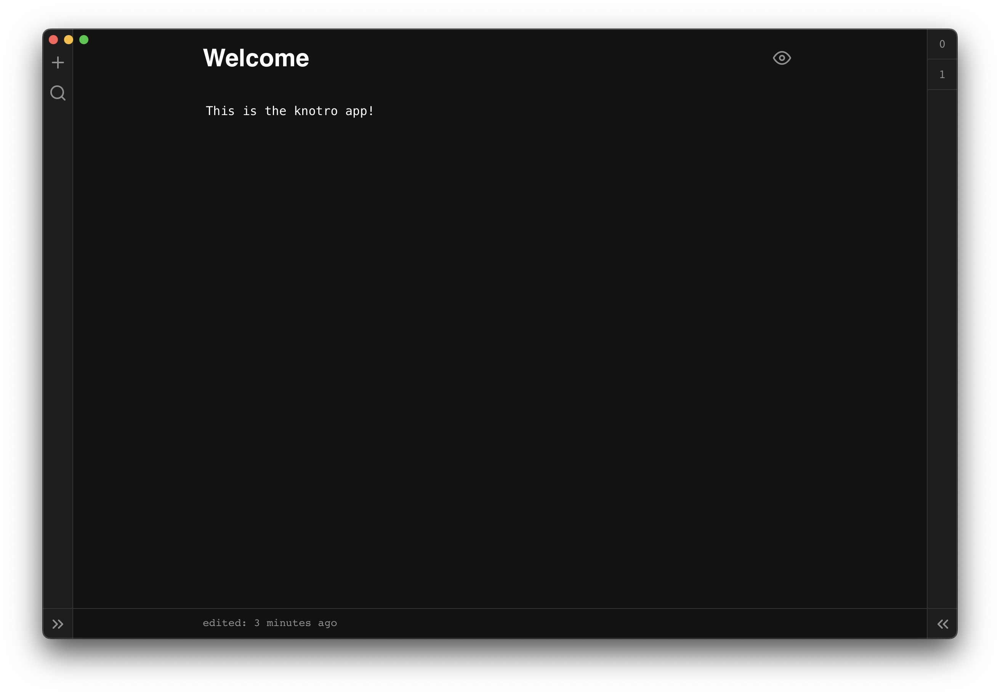

## Knotro

Knotro reimagined as an app! Knotro gives you a "box" of notes. It is minimal and allows for bi-directional linking similar to what apps like Roam Research and Obsidian do.
> In this branch you will find a desktop app based on knotro. The app uses mainly the frontend code of the original.

### what

The app includes some new features:

- Dark mode
- Fuzzy search
- True offline support

> The ability to share notes is not avalible in the app.

### how

The app has basic [markdown](https://www.markdownguide.org/cheat-sheet/) support. Enter focus mode with `cmd + j` / `cntrl + j` and toggle edit mode with `cmd + i` / `cntrl + i`. To create backlinks, type two brackets around the note name, like this: `[[Note Name]]`.

### future

I'm developing a few more useful features and quality improvements that I'm planning to release soon. Any changes and features I make will maintain the original's minimal aesthetic.
